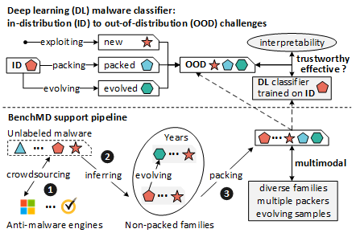

# BenchMD: A Benchmark Malware Dataset with Multimodal Samples for Trustworthy Family Classification

## Introduction

Malware family classification holds immense importance for ensuring public safety, to which deep learning (DL) classifiers have been widely proposed. Since such classifiers are opaque, non-intuitive, and cannot handle samples beyond the training distribution, it is difficult to convince analysts even if these classifiers achieve high testing accuracy. Trustworthy family classification is thus a long-pursued objective to detect and explain out-of-distribution (OOD) samples. However, research in this field has been hindered by the fact that the annotation of multimodal family samples is expensive. To provide the necessary data to advance further, this paper introduces a new Benchmark Malware Dataset (BenchMD), which contains 1.3M multimodal samples of 427 families that evolve over years. BenchMD organizes family samples by year of their appearance, for each family year, it offers four representative modal samples: non-packed and the corresponding UPX, MPRESS, and AES packed ones, with an average of 50-1000 samples per modality. BenchMD thus can support research on three main types of OOD malware detection, as well as the respective interpretability issues: 1) introducing new families, 2) appearing packed families, and 3) emerging evolved families. As another contribution, we propose a novel crowdsourced intelligence-based annotation method, which unifies packing detection and family annotation as a consensus inference problem, preventing costly packing detection and outputting clean non-packed family samples. Moreover, we conduct two case studies based on BenchMD: multi-type OOD malware detection and multi-class malware family classification. We illustrate the impact of OOD malware on DL-based classifiers, show missing elements in existing OOD detection and explanation methods, and discuss how BenchMD can support future research efforts.

> Illustration of BenchMD in supporting trustworthy family classification. Deep learning-based classifiers trained
on in-distribution (ID) data cannot properly handle out-of-distribution (OOD) samples. BenchMD provides the needed multimodal family samples to advance further.

## Code

Features and classifiers are in code directory.

## Download

Due to the limitation of the anonymization rules, BenchMD download will be available post-publication.